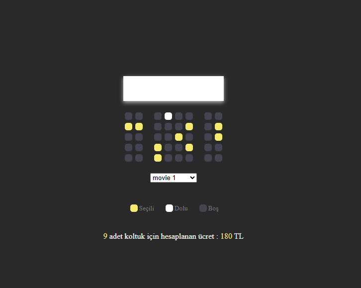

# 🎬 Sinema Bilet Rezervasyon Uygulaması

Bu proje, kullanıcıların bir sinema salonunda **koltuk seçimi yapabildiği**, **film seçimine göre fiyat hesaplayan** ve seçimleri **localStorage ile saklayan** basit ama öğretici bir JavaScript uygulamasıdır.

Frontend geliştirme sürecinde:
- **DOM Manipülasyonu**
- **Event Delegation**
- **Local Storage kullanımı**
- **State (durum) yönetimi mantığı**

gibi temel ama kritik konular uygulanmıştır.

---

## 🚀 Özellikler

- 🎟️ Koltuk seçme / seçimi kaldırma
- 🚫 Dolu (reserved) koltukların seçilememesi
- 🎬 Film seçimine göre bilet fiyatının otomatik hesaplanması
- 💾 Seçilen koltukların ve filmin **localStorage**’da saklanması
- 🔄 Sayfa yenilendiğinde seçimlerin korunması
- 🖱️ Hover efektleri ile kullanıcı dostu arayüz

---

## 🧠 Kullanılan Teknolojiler

- **HTML5** – Yapısal iskelet
- **CSS3** – Görsel tasarım ve animasyonlar
- **Vanilla JavaScript (ES6+)**
  - DOM API
  - Event Delegation
  - localStorage

Herhangi bir framework veya kütüphane kullanılmamıştır.

---

## 📁 Proje Yapısı

📦 cinema-seat-booking
├── index.html
├── styles.css
├── script.js
└── README.md